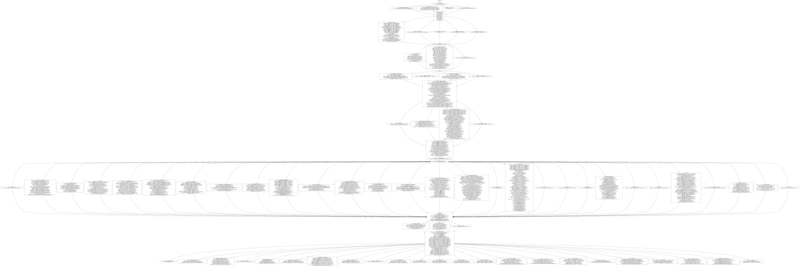

# Reconciliation

This document describes the cluster-version operator's reconciliation logic and explains how the operator applies a release image to the cluster.

## Release image content

```console
$ mkdir /tmp/release
$ oc image extract quay.io/openshift-release-dev/ocp-release:4.5.1-x86_64 --path /:/tmp/release
$ ls /tmp/release/release-manifests
0000_03_authorization-openshift_01_rolebindingrestriction.crd.yaml
0000_03_quota-openshift_01_clusterresourcequota.crd.yaml
0000_03_security-openshift_01_scc.crd.yaml
0000_05_config-operator_02_apiserver.cr.yaml
0000_05_config-operator_02_authentication.cr.yaml
...
0000_90_openshift-controller-manager-operator_02_servicemonitor.yaml
0000_90_openshift-controller-manager-operator_03_operand-servicemonitor.yaml
image-references
release-metadata
$ cat /tmp/release/release-manifests/release-metadata
{
  "kind": "cincinnati-metadata-v0",
  "version": "4.1.0",
  "previous": [],
  "metadata": {
    "description": "",
    "url": "https://access.redhat.com/errata/RHBA-2019:0758"
  }
}
$ cat /tmp/release/release-manifests/image-references
{
  "kind": "ImageStream",
  "apiVersion": "image.openshift.io/v1",
  "metadata": {
    "name": "4.1.0",
    "creationTimestamp": "2019-06-03T14:49:14Z",
    "annotations": {
      "release.openshift.io/from-image-stream": "ocp/4.1-art-latest-2019-05-31-174150",
      "release.openshift.io/from-release": "registry.ci.openshift.org/ocp/release:4.1.0-0.nightly-2019-05-31-174150"
    }
  },
  "spec": {
    "lookupPolicy": {
      "local": false
    },
    "tags": [
      {
        "name": "aws-machine-controllers",
        "annotations": {
          "io.openshift.build.commit.id": "d8d8e285fc19920c3311e791f4fe22db7003588f",
          "io.openshift.build.commit.ref": "",
          "io.openshift.build.source-location": "https://github.com/openshift/cluster-api-provider-aws"
        },
        "from": {
          "kind": "DockerImage",
          "name": "quay.io/openshift-release-dev/ocp-v4.0-art-dev@sha256:7483248489c918e0c65a6b391bd171da0565cb9995b2acc61a1e517b6551e037"
        },
        "generation": 2,
        "importPolicy": {},
        "referencePolicy": {
          "type": "Source"
        }
      },
      ...
    ]
  },
  "status": {
    "dockerImageRepository": ""
  }
}
```

## Manifest graph

The cluster-version operator unpacks the release image, ingests manifests, loads them into a graph.
For upgrades, the graph is ordered by the number and component of the manifest file:

<div style="text-align:center">
  
</div>

The `0000_03_authorization-openshift_*` manifest gets its own node, the `0000_03_quota-openshift_01_*` manifest gets its own node, and the `0000_03_security-openshift_*` manifest gets its own node.
The next group of manifests are under `0000_05_config-operator_*`.
Because the number is bumped, the graph blocks until the previous `0000_03_*` are all complete before beginning the `0000_05_*` block.

We are more relaxed for the initial install, because there is not yet any user data in the cluster to be worried about.
So the graph nodes are all parallelized with the by-number ordering flattened out:

<div style="text-align:center">
  
</div>

For the usual reconciliation loop (neither an upgrade between releases nor a fresh install), the flattened graph is also randomly permuted to avoid hanging on ordering bugs.

## Reconciling the graph

The cluster-version operator spawns worker goroutines that walk the graph, pushing manifests in their queue.
For each manifest in the node, the worker reconciles the cluster with the manifest using a resource builder.
On error (or timeout), the worker abandons the manifest, graph node, and any dependencies of that graph node.
On success, the worker proceeds to the next manifest in the graph node.

## Resource builders

Resource builders reconcile a cluster object with a manifest from the release image.
The general approach is to generates a merged manifest combining critical spec properties from the release-image manifest with data from a preexisting in-cluster object, if any.
If the merged manifest differs from the in-cluster object, the merged manifest is pushed back into the cluster.

Some types have additional logic, as described in the following subsections.
Note that this logic only applies to manifests included in the release image itself.
For example, only [ClusterOperator](../dev/clusteroperator.md) from the release image will have the blocking logic described [below](#clusteroperator); if an admin or secondary operator pushed a ClusterOperator object, it would not impact the cluster-version operator's graph reconciliation.

### ClusterOperator

The cluster-version operator does not push [ClusterOperator](../dev/clusteroperator.md) into the cluster.
Instead, the operators create ClusterOperator themselves.
The ClusterOperator builder only monitors the in-cluster object and blocks until it is:

* Available
* The ClusterOperator contains at least the versions listed in the associated release image manifest.
    For example, an OpenShift API server ClusterOperator entry in the release image like:

    ```yaml
    apiVersion: config.openshift.io/v1
    kind: ClusterOperator
    metadata:
      name: openshift-apiserver
    spec: {}
    status:
      versions:
        - name: operator
          version: "4.1.0"
    ```

    would block until the in-cluster ClusterOperator reported `operator` at version 4.1.0.
* Not degraded (except during initialization, where we ignore the degraded status)

### CustomResourceDefinition

After pushing the merged CustomResourceDefinition into the cluster, the builder monitors the in-cluster object and blocks until it is established.

### DaemonSet

The builder does not block after an initial DaemonSet push (when the in-cluster object has generation 1).

For subsequent updates, the builder blocks until:

* The in-cluster object's observed generation catches up with the specified generation.
* Pods with the release-image-specified configuration are scheduled on each node.
* There are no nodes without available, ready pods.

### Deployment

The builder does not block after an initial Deployment push (when the in-cluster object has generation 1).

For subsequent updates, the builder blocks until:

* The in-cluster object's observed generation catches up with the specified generation.
* Sufficient pods with the release-image-specified configuration are scheduled to fulfill the requested `replicas`.
* There are no unavailable replicas.

### Job

After pushing the merged Job into the cluster, the builder blocks until the Job succeeds.

The cluster-version operator will panic if spec.selector is set because there are no clear use-cases for setting it in release manifests.

Subsequent updates:

* The cluster-version operator is currently unable to delete and recreate a Job to track changes in release manifests. Please avoid making changes to Job manifests until the cluster-version operator supports Job delete/recreate.
* A Job's spec.selector will never be updated because spec.selector is immutable.
